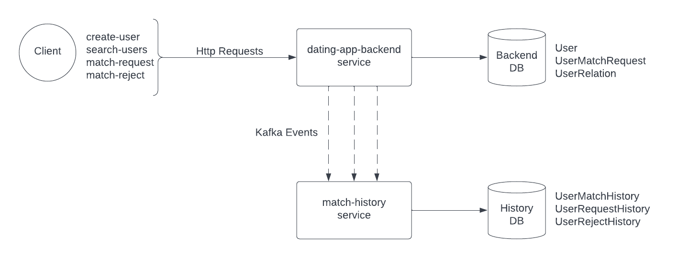

# Dating App-Backend
Microservices Nestjs dating app backend project with basic functionalities.

[furkanayik.94@gmail.com](furkanayik.94@gmail.com)
November 2022


## Overview
This repository contains two services of a microservices project. It is a backend project for a dating app with the
basic functionalities. *dating-app-match-history* service is created for microservices practice and doesn't provide
any major logic, its purpose is consuming the activity events and inserting the history tables in the database.

## Tech Stack&Tools

- [nestjs/express](https://nestjs.com/)
- [typescript](https://www.typescriptlang.org/)
- [postgresql](https://www.postgresql.org/)
- [prisma (ORM)](https://www.prisma.io/)
- [apache kafka](https://kafka.apache.org/)
- [kafkajs](https://kafka.js.org/)
- [zookeper](https://hub.docker.com/_/zookeeper)
- [docker](https://www.docker.com/)
- [jest](https://jestjs.io/)
- [momentjs](https://momentjs.com/)
- [class-transformer](https://github.com/typestack/class-transformer)
- [class-validator](https://github.com/typestack/class-validator)

## Deploy
Both services are uploaded in the same repository. They can be initialized separately after cloning this 
repository.

Start docker and postgresql server, install the dependencies for both services. There are example `.env` files in the root 
of each service. Copy the content and replace the variable `DATABASE_URL` with your database url.

Each service has the file `docker-compose-local-dev.yml` in the root directory. This will deploy the env locally with the
database and kafka client.

### To start the services;
Go to one of the services directory and run below commands;
* `npm run local-env:up`
* `npm run prisma-generate`
* `npm run prisma-migrate`
* `npm run start`

then go to other services directory via separate terminal and run below commands;
* `npm run prisma-generate`
* `npm run prisma-migrate`
* `npm run start`

Both services should be running at the same time and on the consoles you should see the message **"Nest application successfully started"**

You can test the http://localhost:3000/health endpoint to test the app. (3001 for match-history service)

In order to stop the running services run the command below;
* `npm run local-env:down`


## Development



### dating-app-backend service

This service exposes below endpoints to provide the client related functionalities.
* /users/create (POST)
* /users/:userId (GET)
* /users/get-users (POST)
* /users/:userId/search-users (GET)
* /users/:userId/match-request (POST)
* /users/:userId/match-reject (POST)

Some of these endpoints are created to for testing. Functionality is pretty simple;
user searches possible users to match. And then for each possible match, user makes a request or reject. In the case of request;
if target user also makes a request for the requesting user, they match.
(typical swipe right-left logic with dating apps)

When a user searches for possible matches, they don't see the people they previously requested, rejected or matched.

All this functionalities wraped in the `user.module` 

Apart from `user.module`, there is a `kafka.module` to produce the kafka events. In the `kafka.service` below kafka events
are created to emit the related events.

* users_matched
* user_request
* user_reject

`user.module`'s `user.service` handles the logic, calls the repository functions for db operations alongside with the `kafka.service`
to emit the events.

`user.module`'s controllers exposes the endpoints and repository functions runs the db operations via `prisma`

### dating-app-match-history service

This service is responsible from consuming the user activity events produced by backend service and insert to the history tables.
`action-history.module` operates this functionality within its consumers, service and repository files.

## Sample Test Scenario

* Create multiple users with the sample payload below by using the endpoint */users/create (POST)*

    *Call the endpoint for each user, change the name, gender, attractedTo attributes.

    ```
    {
      "name": "alice1",
      "lastName": "doe",
      "language": "english",
      "age": 26,
      "gender": "female",
      "attractedTo": "male"
    }
    ```

* List the users created by using the endpoint */users/get-users (POST)*
  *this endpoint provides filtering like below via request body but its not mandatory

    ```
  {
      age": {
        "maxAge": 30,
        "minAge": 22
      }
  }
    ```
  
* Pick a `userId` from the list and search for possible matches by using the endpoint */:userId/search-users (POST)*

    *Notice that response brings the users according to requesting user's `attractedTo` attribute


* Pick a `userId` from the list to make a request. Use the endpoint */:userId/match-request (POST)* with the target user's
userId in the request body. `{"targetUserId": "userId"}`

    *Notice that this action emits the `user_request` event and history service inserts the record to the db.

* Change the url param to the target user that you used in the previous request, put previous request's request userId to 
request body as `targetUserId` (swap the requesting-target userIds) and make the request.
    
    *Notice that response indicates that they are matched, this action emits the event `users_matched` and history service 
    inserts the history record to the `UserMatchHistory` table.

## Notes
Since this is not a real life project but practice,
genders-sexual orientations of the users defined as binary in order to keep the complexity low initially.
Author of the project recognizes other genders and orientations exist and should be implemented in real life projects. 🌈

As mentioned before, this project contains the basic functionality and focused on practice. There are assumptions like;
if we'd have the frontend implementation, client side would have the userId when making a user search. 
Instead, in the sample test section get-users endpoint is provided to pick a userId.

#### Ideas For Future Development;

* Unit-Integration tests, full test coverage, workflow for the tests
* Improve the functionality with more logic
* Add pagination for the endpoints where list of users are returned.
* Notification service can be implemented to send notifications
* Chat room feature can be implemented for matched users so they can text


### Thanks for having a look! 😊